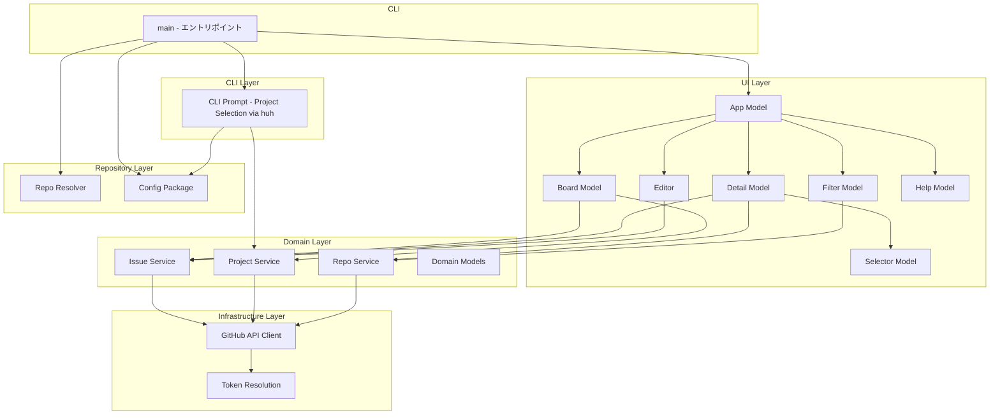
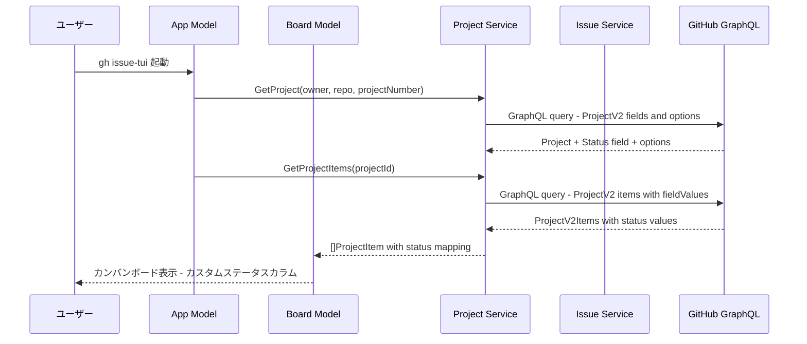
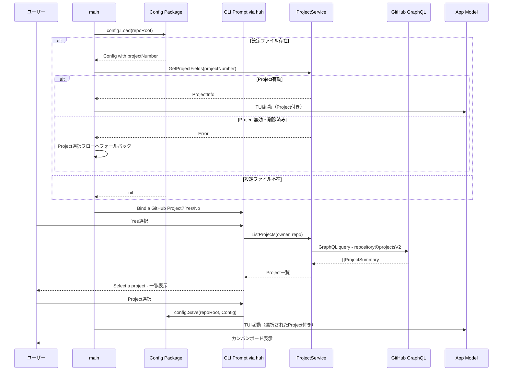
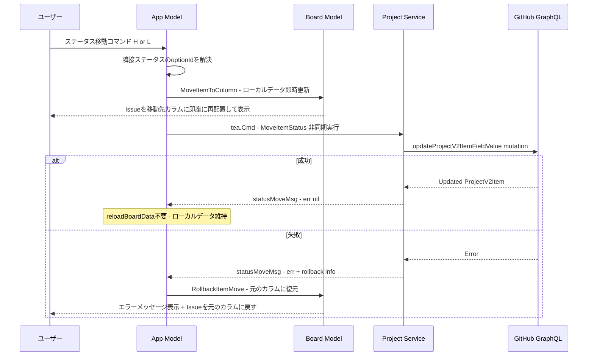
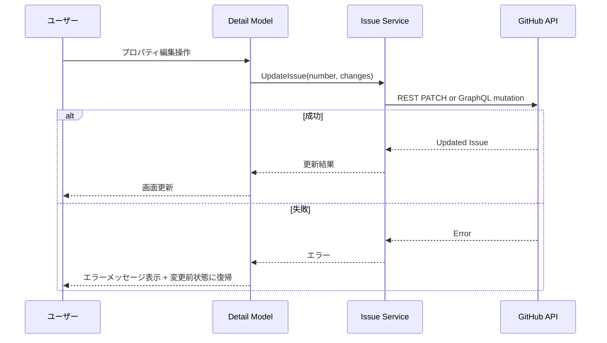
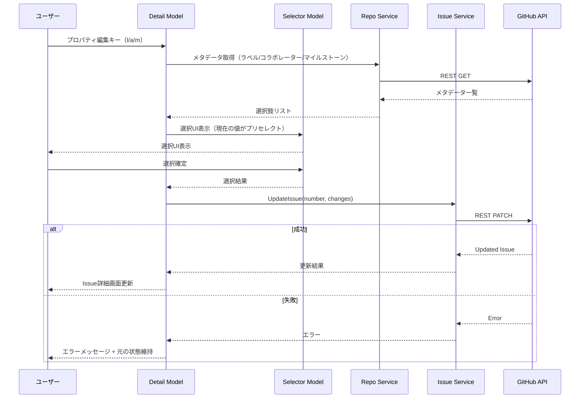
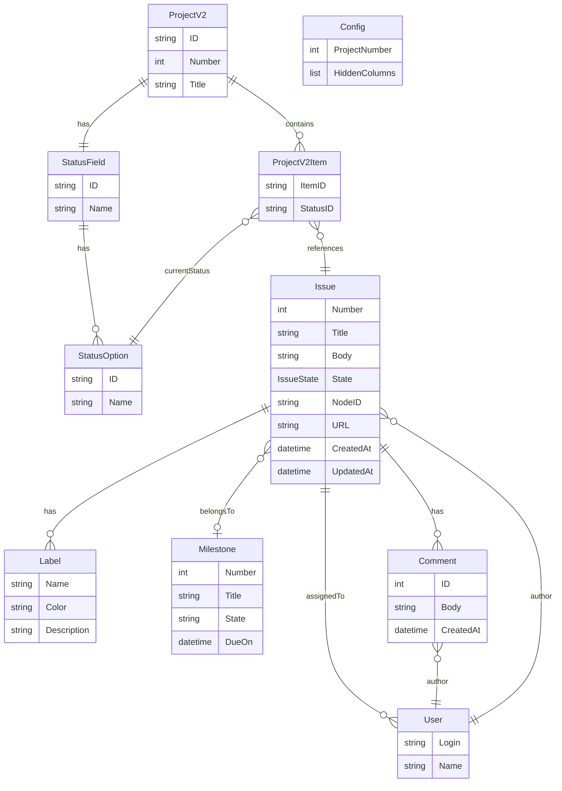

# Design Document

## Overview

**Purpose**: GitHub Issueをカンバンボード形式で管理するGitHub CLI拡張機能を提供する。`gh issue-tui`コマンドとしてターミナル上でIssueの閲覧・編集・作成を完結させる。

**Users**: GitHub上でIssue管理を行う開発者。ターミナルベースのワークフローを好み、ブラウザへの切り替えを最小化したいユーザー。

**Impact**: GitHub CLIのエコシステムにカンバンボード機能を追加し、Issue管理のターミナル体験を大幅に向上させる。

### Goals
- GitHub Projects V2のカスタムステータスに連動したカンバンボードでIssueを視覚的に一覧表示する
- Issue詳細の閲覧・プロパティ編集・新規作成をTUI上で完結させる
- Vimライクなキーバインドおよび矢印キーによるキーボードナビゲーションで効率的な操作を実現する
- ステータス間のIssue移動（左右コマンド）をサポートする
- GitHub CLI拡張機能としてゼロコンフィグでインストール・利用可能にする
- Project紐付けを設定ファイルに永続化し、次回以降の起動を自動化する
- カラム表示・非表示の切り替えで関心のあるステータスに集中できるようにする
- Issue詳細画面からプロパティをインラインで編集可能にする

### Non-Goals
- Pull Requestの管理機能
- 複数リポジトリの同時表示
- オフラインモード・ローカルキャッシュの永続化
- Issue テンプレートのサポート
- Projects V2のカスタムフィールド（Status以外）の編集

## Architecture

### Architecture Pattern & Boundary Map

Elmアーキテクチャ（Model→Update→View）をBubble Teaが提供する基盤上に構築し、UIレイヤーとインフラレイヤーをクリーンに分離する。



**Architecture Integration**:
- **Selected pattern**: Elmアーキテクチャ + レイヤード構成。Bubble Tea v2の標準パターンに準拠しつつ、GitHub API層を分離
- **Domain boundaries**: UI Model群はBubble Teaのtea.Modelインターフェースを実装。Domain ServiceはUI非依存でAPIアクセスを抽象化
- **Package structure**: `internal/domain/`にドメインモデルを集約、`internal/repo/`にリポジトリ検出ロジックを分離、`internal/config/`に設定ファイルI/Oを配置
- **New components rationale**: 各画面（Board/Detail/Editor/Filter/Help）を独立Modelとして分離し、並行開発を可能にする。SelectorModelは汎用的な選択UIコンポーネントとしてDetailとFilterで再利用。Project選択はTUI起動前にCLI層のインラインプロンプト（`charmbracelet/huh`）で実行し、TUI内の画面遷移から分離

### Technology Stack

| Layer | Choice / Version | Role in Feature | Notes |
|-------|------------------|-----------------|-------|
| Language | Go 1.22+ | 実装言語 | gh extensionの標準言語 |
| TUI Framework | Bubble Tea v2 | UI描画・イベント処理 | charm.land/bubbletea/v2 |
| Styling | Lip Gloss | ターミナルスタイリング | カラー・ボーダー・レイアウト |
| Components | Bubbles | 再利用コンポーネント | viewport, textinput等 |
| GitHub API | Raw HTTP Client | 認証・REST/GraphQL通信 | net/http + 手動Bearer認証。トークンはGH_TOKEN/GITHUB_TOKEN環境変数または`gh auth token`から解決 |
| GitHub API | GraphQL + REST | Issue CRUD操作 | 読み取りGraphQL、更新REST補完 |
| Markdown | glamour | Markdown→ターミナル描画 | Issue本文・コメント表示 |
| CLI Prompt | charmbracelet/huh | TUI起動前のインラインプロンプト | Project紐付け確認・Project選択 |
| CLI Flags | spf13/pflag | コマンドライン引数処理 | --repo, --project, --config, --version |
| Build/Release | gh-extension-precompile | マルチプラットフォームビルド | GitHub Actions |
| Config Storage | encoding/json | 設定ファイル永続化 | Go標準ライブラリ、外部依存なし |

> デザイン初期段階ではgo-gh v2を検討していたが、Raw HTTPクライアントによるシンプルな実装を採用した。詳細な技術選定の根拠は `research.md` を参照。

## System Flows

### Issue取得・カンバン表示フロー



### 初回起動・Project紐付けフロー



Project選択はTUI起動前にCLIのインラインプロンプト（`charmbracelet/huh`のConfirm/Select）で実行される。`gh repo create`等のGitHub CLIと同様のUXを提供する。

### Issueステータス移動フロー（楽観的UI更新）



楽観的UI更新により、ユーザーはAPI応答を待たずにIssueの移動を即座に確認できる。API成功時はreloadBoardDataを行わず、ローカルデータをそのまま維持する。失敗時はロールバック情報（元のStatusID・カラムインデックス）を使ってアイテムを元の位置に戻す。

### Issue編集フロー



### Issue詳細インライン編集フロー



## Requirements Traceability

| Requirement | Summary | Components | Interfaces | Flows |
|-------------|---------|------------|------------|-------|
| 1.1 | gh extension installでインストール可能 | Main, Build設定 | CLI | - |
| 1.2 | gh issue-tuiで起動 | Main | CLI | - |
| 1.3 | gh auth token認証 | GHClient, GHAuth | GitHubClient | - |
| 1.4 | 未認証時エラー表示 | GHClient | GitHubClient | - |
| 1.5 | リポジトリ自動検出 | RepoResolver | RepoResolver | - |
| 1.6 | --repoフラグ指定 | Main | CLI | - |
| 2.1 | カンバンボード表示 | Board | BoardModel | Issue取得フロー |
| 2.2 | Project定義カスタムステータスカラム | Board, ProjectService | BoardModel, ProjectService | Issue取得フロー |
| 2.3 | Issueカード情報表示 | Board | IssueCard | - |
| 2.4 | カラム内スクロール | Board | BoardModel | - |
| 2.5 | レスポンシブレイアウト | Board | BoardModel | - |
| 3.1 | フィルタリング | Filter, Board | FilterModel | - |
| 3.2 | ソート | Filter, Board | FilterModel | - |
| 3.3 | フィルタ条件表示 | Filter | FilterModel | - |
| 3.4 | フィルタ結果0件表示 | Board | BoardModel | - |
| 4.1 | Issue詳細ビュー表示 | Detail | DetailModel | - |
| 4.2 | 詳細情報（Markdown含む） | Detail | DetailModel | - |
| 4.3 | コメント一覧表示 | Detail | DetailModel | - |
| 4.4 | 詳細ビュースクロール | Detail | DetailModel | - |
| 5.1 | ステータス移動（楽観的UI更新） | App, Board, ProjectService | BoardModel, ProjectService | ステータス移動フロー |
| 5.2 | タイトル編集 | Editor | Editor | Issue編集フロー |
| 5.3 | 本文編集（$EDITOR） | Editor | Editor | Issue編集フロー |
| 5.4 | ラベル編集 | Detail, IssueService | IssueService | Issue編集フロー |
| 5.5 | アサイニー編集 | Detail, IssueService | IssueService | Issue編集フロー |
| 5.6 | マイルストーン編集 | Detail, IssueService | IssueService | Issue編集フロー |
| 5.7 | ステータス移動API失敗時ロールバック | App, Board | BoardModel | ステータス移動フロー |
| 5.8 | 編集後カンバン画面復帰 | App, Detail, Editor | AppModel | - |
| 5.9 | ステータス移動成功時reloadBoardData省略 | App | AppModel | ステータス移動フロー |
| 6.1 | Issue新規作成フォーム | Editor | Editor | - |
| 6.2 | 本文入力（$EDITOR） | Editor | Editor | - |
| 6.3 | 作成後カンバン更新 | Board, IssueService | IssueService | - |
| 6.4 | 作成時メタデータ設定 | Editor | Editor | - |
| 7.1 | コメント追加（$EDITOR） | Detail, Editor | Editor | - |
| 7.2 | コメント一覧更新 | Detail | DetailModel | - |
| 7.3 | コメント投稿失敗時保持 | Editor | Editor | - |
| 8.1 | Vim + 矢印キーナビゲーション | App | KeyMap | - |
| 8.2 | Enter/Esc操作 | App | KeyMap | - |
| 8.3 | ヘルプ表示 | Help | HelpModel | - |
| 8.4 | q終了 + 画面クリア | App | KeyMap, tea.WithAltScreen | - |
| 8.5 | キーバインドヒント | App | StatusBar | - |
| 9.1 | リフレッシュ | Board, IssueService | IssueService | Issue取得フロー |
| 9.2 | ローディング表示 | Board | BoardModel | - |
| 9.3 | タイムアウト時キャッシュ表示 | IssueService | IssueService | - |
| 10.1 | 初回起動時Project紐付け確認CLIプロンプト | Main, CLIPrompt | huh.Confirm | 初回起動フロー |
| 10.2 | Yes選択時Project一覧選択CLIプロンプト | Main, CLIPrompt, ProjectService | huh.Select, ProjectService | 初回起動フロー |
| 10.3 | No選択時Open/Closed 2カラム表示 | Main, Board | AppModel, BoardModel | 初回起動フロー |
| 10.4 | 設定ファイル保存 | Config Package | config.Save | 初回起動フロー |
| 10.5 | 次回起動時設定自動読み込み | Main, Config Package | config.Load | 初回起動フロー |
| 10.6 | --projectフラグ優先 | Main | CLI | - |
| 10.7 | --configフラグで設定変更 | Main, CLIPrompt | CLI, huh.Confirm, huh.Select | 初回起動フロー |
| 10.8 | 無効Project時の再選択 | Main, CLIPrompt | Config Package, ProjectService, huh | 初回起動フロー |
| 11.1 | カラム非表示操作 | Board | BoardModel | - |
| 11.2 | カラム表示復元操作 | Board | BoardModel | - |
| 11.3 | 非表示カラム数ステータスバー表示 | Board, App | BoardModel, StatusBar | - |
| 11.4 | 最低1カラム表示維持 | Board | BoardModel | - |
| 11.5 | カラム非表示設定の永続化 | Board, App, Config Package | BoardModel, config.Save | - |
| 11.6 | 存在しないカラム名の無視 | Board | BoardModel | - |
| 12.1 | 詳細画面ラベルインライン編集 | Detail, Selector, RepoService, IssueService | DetailModel, SelectorModel | インライン編集フロー |
| 12.2 | 詳細画面アサイニーインライン編集 | Detail, Selector, RepoService, IssueService | DetailModel, SelectorModel | インライン編集フロー |
| 12.3 | 詳細画面マイルストーンインライン編集 | Detail, Selector, RepoService, IssueService | DetailModel, SelectorModel | インライン編集フロー |
| 12.4 | 編集完了後詳細画面復帰・更新反映 | Detail | DetailModel | インライン編集フロー |

## Components and Interfaces

| Component | Domain/Layer | Intent | Req Coverage | Key Dependencies | Contracts |
|-----------|-------------|--------|--------------|------------------|-----------|
| CLIPrompt | CLI | TUI起動前のProject紐付け確認・選択 | 10.1-10.3, 10.7-10.8 | ProjectService (P0), Config Package (P0), huh (P0) | Service |
| App | UI | トップレベル画面遷移・キーバインド管理・ステータス移動制御 | 5.1, 5.7, 5.8, 5.9, 8.1-8.5, 11.3 | Board, Detail, Editor, Filter, Help (P0) | State |
| Board | UI | カンバンボード表示・ナビゲーション・アイテム移動 | 2.1-2.5, 3.4, 5.1, 5.7, 9.2, 11.1-11.6 | IssueService (P0), ProjectService (P0), Filter (P1) | State |
| Detail | UI | Issue詳細表示・プロパティ操作・インライン編集 | 4.1-4.4, 5.4-5.6, 7.1-7.2, 12.1-12.4 | IssueService (P0), RepoService (P1), Selector (P0) | State |
| Selector | UI | 汎用マルチ/シングルセレクトUIコンポーネント | 12.1-12.4 | なし | State |
| Editor | UI | テキスト入力・外部エディタ起動 | 5.2-5.3, 6.1-6.4, 7.1, 7.3 | IssueService (P0) | State |
| Filter | UI | フィルタ・ソートUI | 3.1-3.3 | RepoService (P1) | State |
| Help | UI | キーバインドヘルプ表示 | 8.3 | なし | State |
| IssueService | Domain | Issue CRUD操作の抽象化 | 5.2-5.7, 6.3, 7.2, 9.1, 9.3, 12.1-12.3 | GHClient (P0) | Service |
| ProjectService | Domain | GitHub Projects V2ステータス管理 | 2.2, 5.1, 10.2 | GHClient (P0) | Service |
| RepoService | Domain | リポジトリメタデータ取得 | 3.1, 12.1-12.3 | GHClient (P0) | Service |
| RepoResolver | Repository | リポジトリowner/name検出 | 1.5 | git CLI (P0) | Service |
| Config Package | Repository | 設定ファイルの読み書き | 10.4-10.8, 11.5-11.6 | File I/O (P0) | Service |
| GHClient | Infrastructure | GitHub API通信 | 1.3-1.4 | net/http (P0) | Service |

### UI Layer

#### App Model

| Field | Detail |
|-------|--------|
| Intent | トップレベルの画面遷移管理とグローバルキーバインドのディスパッチ |
| Requirements | 5.1, 5.7, 5.8, 5.9, 8.1, 8.2, 8.3, 8.4, 8.5, 11.3 |

**Responsibilities & Constraints**
- 現在のアクティブ画面（Board/Detail/Editor/Filter/Help）の管理
- グローバルキーバインド（q終了、?ヘルプ、Escで戻る）の処理。Vimキーバインド（h/j/k/l）と矢印キー（←/↓/↑/→）の両方をサポート
- 画面下部のステータスバー・キーバインドヒントの描画
- ステータス移動の楽観的UI更新の制御: handleStatusMoveでローカルデータを先行更新（Board.MoveItemToColumn）し、非同期でAPI呼び出し（5.1）
- ステータス移動API失敗時のロールバック: statusMoveMsgのエラー時にBoard.RollbackItemMoveを呼び出し（5.7）
- ステータス移動API成功時: reloadBoardDataを呼び出さず、ローカルデータを維持（5.9）
- 編集操作完了後のカンバンボード画面への確実な復帰（5.8）
- `tea.WithAltScreen()`オプションによるaltscreenモードの使用（終了時の画面クリア、8.4）
- 非表示カラム数のステータスバー表示（11.3）
- Project選択はTUI起動前にCLI層で完了済み。AppModelはprojectNumberを受け取るのみ

**Dependencies**
- Outbound: Board, Detail, Editor, Filter, Help — 各画面Modelへの遷移 (P0)

**Contracts**: State [x]

##### State Management

```go
type ViewState int

const (
    ViewBoard ViewState = iota
    ViewDetail
    ViewEditor
    ViewFilter
    ViewHelp
)

type AppModel struct {
    currentView    ViewState
    prevView       ViewState
    board          BoardModel
    detail         DetailModel
    filter         FilterModel
    help           HelpModel
    statusMsg      string
    width          int
    height         int
    issueSvc       *service.IssueService
    repoSvc        *service.RepoService
    projectSvc     *service.ProjectService
    projectNumber  int
    projectError   string
    lastEditType   editType
    repoRoot       string
    cfg            *config.Config
}

// ステータス移動の非同期結果メッセージ（楽観的UI更新のロールバック情報を含む）
type statusMoveMsg struct {
    err              error
    itemID           string  // ロールバック対象のアイテムID
    originalStatusID string  // 変更前のステータスオプションID
    originalColIdx   int     // 変更前のカラムインデックス
}
```

- Persistence: メモリ内のみ（永続化なし）
- Concurrency: Bubble Teaのシングルスレッドイベントループで管理

#### Board Model

| Field | Detail |
|-------|--------|
| Intent | Issue一覧をGitHub Projects V2のカスタムステータスカラムでカンバンボード形式で描画する |
| Requirements | 2.1, 2.2, 2.3, 2.4, 2.5, 3.4, 5.1, 5.7, 9.2, 11.1, 11.2, 11.3, 11.4, 11.5, 11.6 |

**Responsibilities & Constraints**
- GitHub Projects V2のStatusフィールドのoptionsに基づくN個の動的カラムレイアウトでIssueカードを描画
- カラム間・カード間のカーソル移動（h/j/k/l および ←/↓/↑/→）
- ステータス移動の楽観的UI更新: AppModelからの指示でアイテムをカラム間で即座に移動する`MoveItemToColumn`メソッドを提供（5.1）
- ステータス移動のロールバック: API失敗時にアイテムを元のカラムに復元する`RollbackItemMove`メソッドを提供（5.7）
- フィルタ適用後のIssue一覧の再描画
- ターミナルサイズ変更時のレスポンシブ対応（カラム数に応じた幅分配）
- カラム表示・非表示の切り替え（11.1, 11.2）。`hiddenCols`マップで管理し、表示カラムのみの仮想インデックスで`activeCol`を制御
- 非表示カラム数をステータスバー情報として返却（11.3）
- 最低1カラムの表示を維持するガード条件（11.4）
- カラム非表示設定の変更時に`wantConfigUpdate`フラグで通知し、設定ファイルへの永続化をトリガー（11.5）

**Dependencies**
- Inbound: App — 画面遷移で表示 (P0)
- Outbound: IssueService — Issue一覧取得 (P0)
- Outbound: ProjectService — Projectステータス情報取得・ステータス移動 (P0)
- Outbound: Filter — フィルタ条件の適用 (P1)

**Contracts**: State [x]

##### State Management

```go
type BoardModel struct {
    columns          []StatusColumn
    allItems         []domain.ProjectItem
    activeCol        int
    cursorIndex      map[int]int
    scrollOffset     map[int]int
    hiddenCols       map[int]bool
    wantConfigUpdate bool
    wantStatusMove   int     // -1=left, 1=right, 0=none
    wantStatusMsg    string
    loading          bool
    filterState      FilterState
    selectedIssue    *domain.Issue
    projectInfo      *domain.ProjectInfo
    width            int
    height           int
}

type StatusColumn struct {
    OptionID string
    Name     string
    Items    []domain.ProjectItem
}

type ProjectItem struct {
    ItemID   string
    Issue    Issue
    StatusID string
}
```

**Implementation Notes**
- カラム非表示: `hiddenCols[colIndex] = true`で管理。描画時は`hiddenCols`をスキップし、表示カラムのみでレイアウト幅を分配
- カーソル移動: `activeCol`は常に表示カラムの仮想インデックスを参照。`visibleColumns()`ヘルパーで実カラムインデックスと仮想インデックスを変換
- 全復元: `hiddenCols`をクリアし、全カラムを表示に戻す
- ガード: `len(columns) - len(hiddenCols) <= 1`の場合、非表示操作を拒否しステータスメッセージで通知
- 楽観的UI更新: `MoveItemToColumn(itemID, fromColIdx, toColIdx)`でアイテムをcolumns[from].Itemsから削除しcolumns[to].Itemsに追加。アイテムのStatusIDも更新する。カーソル位置は移動先カラムの末尾に追従する
- ロールバック: `RollbackItemMove(itemID, originalStatusID, originalColIdx)`でアイテムを元のカラムに戻しStatusIDを復元する
- 永続化: `d`/`D`操作時に`wantConfigUpdate = true`を設定。AppModelがフラグを検知し、現在の`hiddenCols`をカラム名リストに変換してconfig.Saveで保存
- 起動時復元: `SetProjectData()`/`SetFallbackIssues()`後にConfigの`HiddenColumns`カラム名リストから`hiddenCols`マップを構築。存在しないカラム名は無視（11.6）

#### Detail Model

| Field | Detail |
|-------|--------|
| Intent | Issue詳細情報の表示とプロパティのインライン編集 |
| Requirements | 4.1, 4.2, 4.3, 4.4, 5.4, 5.5, 5.6, 7.1, 7.2, 12.1, 12.2, 12.3, 12.4 |

**Responsibilities & Constraints**
- Issue本文のMarkdownレンダリング（glamour使用）
- メタデータ（ラベル、アサイニー、マイルストーン、日時）の表示
- コメント一覧の表示とスクロール
- ラベル/アサイニー/マイルストーンのインライン選択UI表示（SelectorModelを利用）（12.1-12.3）
- 選択確定時にIssueServiceを通じてAPIに反映し、詳細画面を更新（12.4）
- 編集キャンセル時（Esc）は元のIssue詳細表示に戻る

**Dependencies**
- Inbound: App — Board上でIssue選択時に遷移 (P0)
- Outbound: IssueService — プロパティ更新 (P0)
- Outbound: RepoService — ラベル/コラボレーター/マイルストーン一覧取得 (P1)
- Outbound: Editor — テキスト編集への遷移 (P1)
- Outbound: Selector — インライン選択UI (P0)

**Contracts**: State [x]

##### State Management

```go
type DetailModel struct {
    issue            *domain.Issue
    comments         []domain.Comment
    content          string
    scroll           int
    width            int
    height           int
    loading          bool
    errorMsg         string
    wantEdit         editType
    editingField     EditingField
    selector         SelectorModel
    repoSvc          *service.RepoService
    issueSvc         *service.IssueService
    cachedLabels     []domain.Label
    cachedUsers      []domain.User
    cachedMilestones []domain.Milestone
    metadataLoaded   bool
}

type EditingField int

const (
    EditingNone EditingField = iota
    EditingLabels
    EditingAssignees
    EditingMilestone
)
```

**Implementation Notes**
- インライン編集: `l`/`a`/`m`キー押下で`editingField`を遷移。RepoServiceからメタデータを非同期取得し、`selector`に選択肢をセット
- 選択UI: `SelectorModel`はラベル（マルチセレクト）、アサイニー（マルチセレクト）、マイルストーン（シングルセレクト）に対応。`multiSelect`フラグで切り替え
- 確定: Enterキーで選択を確定し、IssueService.UpdateIssueを呼び出し。成功時はIssueデータを更新して詳細表示に復帰
- キャンセル: Escキーで`editingField = EditingNone`に戻り、選択UIを閉じる
- メタデータキャッシュ: セッション中はRepoServiceの結果をキャッシュし（`cachedLabels`/`cachedUsers`/`cachedMilestones`）、同一セッション内の再取得を回避

#### Selector Model

| Field | Detail |
|-------|--------|
| Intent | 汎用的なマルチ/シングルセレクトUIコンポーネント |
| Requirements | 12.1, 12.2, 12.3, 12.4 |

**Responsibilities & Constraints**
- ラベル（マルチセレクト）、アサイニー（マルチセレクト）、マイルストーン（シングルセレクト）に対応
- j/kまたは↑/↓でカーソル移動、Spaceでトグル、Enterで確定、Escでキャンセル
- 選択UIの描画（タイトル、アイテム一覧、選択状態のインジケータ）

**Contracts**: State [x]

##### State Management

```go
type SelectorItem struct {
    ID       string
    Name     string
    Selected bool
}

type SelectorModel struct {
    items       []SelectorItem
    cursor      int
    multiSelect bool
    title       string
    active      bool
    confirmed   bool
    cancelled   bool
}
```

#### Editor

| Field | Detail |
|-------|--------|
| Intent | テキスト入力UIと外部エディタ（$EDITOR）の起動を管理する |
| Requirements | 5.2, 5.3, 6.1, 6.2, 6.3, 6.4, 7.1, 7.3 |

**Responsibilities & Constraints**
- タイトル等の短いテキストはインライン入力（bubbles/textinput）
- 本文・コメント等の長文は$EDITORでの外部エディタ起動
- 外部エディタ起動中はBubble Teaのtea.ExecProcess機能を使用
- 編集失敗時のテキスト保持
- $EDITORが未設定の場合は`vi`にフォールバック

**Dependencies**
- Inbound: App, Detail — 編集操作のトリガー (P0)
- Outbound: IssueService — 変更のAPI反映 (P0)

**Contracts**: State [x]

##### State Management

```go
type editType int

const (
    editNone editType = iota
    editTitle
    editBody
    editComment
    editLabels
    editAssignees
    editMilestone
)
```

**Implementation Notes**
- 外部エディタ起動: 一時ファイルを作成→$EDITORで起動（`tea.ExecProcess`）→内容を読み取り→一時ファイル削除
- Issue新規作成: タイトル入力（textinput）→本文入力（外部エディタ）→IssueService.CreateIssueで作成→Board更新

#### Filter Model

| Field | Detail |
|-------|--------|
| Intent | フィルタ条件・ソート条件のUI選択と適用 |
| Requirements | 3.1, 3.2, 3.3 |

**Responsibilities & Constraints**
- ラベル、アサイニー、マイルストーンのマルチセレクトUI
- ソート条件（作成日/更新日/コメント数）の選択
- 適用中のフィルタ条件の視覚化

**Dependencies**
- Inbound: App — フィルタパネル表示 (P0)
- Outbound: RepoService — ラベル/アサイニー/マイルストーン一覧取得 (P1)

**Contracts**: State [x]

##### State Management

```go
type FilterPane int

const (
    PaneLabels FilterPane = iota
    PaneAssignees
    PaneMilestone
    PaneSort
)

type FilterState struct {
    Labels    []string
    Assignees []string
    Milestone string
    SortField string
    SortDir   string
}

type FilterModel struct {
    state           FilterState
    availLabels     []domain.Label
    availUsers      []domain.User
    availMilestones []domain.Milestone
    activePane      FilterPane
    cursor          int
    applied         bool
    selectedLabels  map[string]bool
    selectedUsers   map[string]bool
}
```

#### Help Model

| Field | Detail |
|-------|--------|
| Intent | キーバインドヘルプ表示 |
| Requirements | 8.3 |

**Contracts**: State [x]

**Implementation Notes**
- カラム表示・非表示のキーバインド（`d`/`D`）をヘルプ一覧に含む
- Issue詳細画面のインライン編集キー（`l`/`a`/`m`）をヘルプ一覧に含む

### CLI Layer

#### CLI Prompt - Project Selection

| Field | Detail |
|-------|--------|
| Intent | TUI起動前にCLIのインラインプロンプトでProject紐付け確認と選択を行う |
| Requirements | 10.1, 10.2, 10.3, 10.7, 10.8 |

**Responsibilities & Constraints**
- TUI（Bubble Tea）起動前にターミナル上でインラインプロンプトを表示（10.1）
- `charmbracelet/huh`の`Confirm`コンポーネントで「Bind a GitHub Project?」のYes/No確認を表示（10.1）
- Yes選択時にProjectService経由でリポジトリのProject一覧を取得し、`huh.Select`で選択肢を表示（10.2）
- No選択時はProject紐付けなしの状態でTUIを起動（10.3）
- 選択確定時にconfig.Save経由で設定ファイルに保存（10.4）
- `--config`フラグによる再設定時も同じフローを使用（10.7）
- Project無効時（削除済み等）はエラーメッセージを表示し、同じプロンプトフローにフォールバック（10.8）
- `internal/cli/prompt.go`として実装し、Bubble Tea TUIとは完全に分離する

**Dependencies**
- Inbound: Main — 初回起動時または--config時に呼び出し (P0)
- Outbound: ProjectService — Project一覧取得 (P0)
- Outbound: Config Package — 設定保存 (P0)
- External: charmbracelet/huh — インラインプロンプトUI (P0)

**Contracts**: Service [x]

##### Service Interface

```go
// ProjectLister はProject一覧取得の依存インターフェース
type ProjectLister interface {
    ListProjects(ctx context.Context) ([]domain.ProjectSummary, error)
}

// PromptProjectSelection はTUI起動前にCLIプロンプトでProject選択を実行する。
// 戻り値: 選択されたProject番号（0はProject紐付けなし）
func PromptProjectSelection(
    lister ProjectLister,
    repoRoot string,
) (int, error)
```

- Step 1: `huh.NewConfirm().Title("Bind a GitHub Project?")` でYes/No確認
- Step 2 (Yesの場合): `lister.ListProjects()` でProject一覧取得
- Step 3: `huh.NewSelect().Title("Select a project")` でProject選択
- Step 4: `config.Save(repoRoot, Config{ProjectNumber: selected})` で設定保存
- Noの場合: 0を返し、Project紐付けなしでTUIを起動

**Implementation Notes**
- `huh`はCharm ecosystemの一部であり、Bubble Tea/Lip Glossと一貫したスタイリングを提供
- プロンプトはaltscreenを使用しないため、選択結果がターミナル履歴に残る
- ProjectListerインターフェースにより、テスト時にProjectService実装をモック可能

### Domain Layer

#### Issue Service

| Field | Detail |
|-------|--------|
| Intent | Issue CRUDおよび関連データ操作をUI層に提供する |
| Requirements | 5.2, 5.3, 5.4, 5.5, 5.6, 5.7, 6.3, 7.2, 9.1, 9.3, 12.1, 12.2, 12.3 |

**Responsibilities & Constraints**
- Issue一覧取得（GraphQL、ペジネーション付き）
- Issue作成・更新（タイトル、本文、ラベル、アサイニー、マイルストーン）
- Issue Open/Closeの操作
- コメント取得・追加
- API失敗時のエラー返却（ロールバックはUI層の責務）
- ステータス変更はProjectServiceの責務（Projects V2 APIを使用）

**Dependencies**
- Inbound: Board, Detail, Editor — CRUD操作 (P0)
- Outbound: GHClient — API通信 (P0)

**Contracts**: Service [x]

##### Service Interface

```go
type IssueService struct {
    client github.GitHubClient
    owner  string
    repo   string
}

func (s *IssueService) ListIssues(ctx context.Context, opts ListIssuesOptions) ([]domain.Issue, domain.PageInfo, error)
func (s *IssueService) GetIssue(ctx context.Context, number int) (domain.Issue, error)
func (s *IssueService) CreateIssue(ctx context.Context, input CreateIssueInput) (domain.Issue, error)
func (s *IssueService) UpdateIssue(ctx context.Context, number int, input UpdateIssueInput) (domain.Issue, error)
func (s *IssueService) CloseIssue(ctx context.Context, number int) error
func (s *IssueService) ReopenIssue(ctx context.Context, number int) error
func (s *IssueService) AddComment(ctx context.Context, number int, body string) (domain.Comment, error)
func (s *IssueService) ListComments(ctx context.Context, number int) ([]domain.Comment, error)

type ListIssuesOptions struct {
    State     domain.IssueState
    Labels    []string
    Assignee  string
    Milestone string
    Sort      string
    Direction string
    PerPage   int
    After     string
}

type CreateIssueInput struct {
    Title     string
    Body      string
    Labels    []string
    Assignees []string
    Milestone string
}

type UpdateIssueInput struct {
    Title     *string
    Body      *string
    Labels    *[]string
    Assignees *[]string
    Milestone *string
}
```

- Preconditions: ownerとrepoが解決済みであること
- Postconditions: API操作の結果が返却される。エラー時はerrorが非nil
- Invariants: ネットワーク障害時はラップされたエラーを返す。nilポインタはフィールド未変更を意味する

#### Project Service

| Field | Detail |
|-------|--------|
| Intent | GitHub Projects V2のステータスフィールド情報の取得およびIssueのステータス変更を管理する |
| Requirements | 2.2, 5.1, 10.2 |

**Responsibilities & Constraints**
- リポジトリに紐づくProjectV2の一覧取得・選択
- Statusフィールド（ProjectV2SingleSelectField）のoptions取得
- ProjectV2Itemの一覧取得（IssueとProjectV2Item IDのマッピング）
- Issueのステータス変更（updateProjectV2ItemFieldValueミューテーション）
- ProjectV2Item IDとIssue IDは異なるため、型レベルで区別する

**Dependencies**
- Inbound: Board — ステータスカラム情報取得・ステータス移動 (P0)
- Inbound: CLIPrompt — Project一覧取得 (P0)
- Outbound: GHClient — API通信 (P0)

**Contracts**: Service [x]

##### Service Interface

```go
type ProjectService struct {
    client github.GitHubClient
    owner  string
    repo   string
}

func (s *ProjectService) ListProjects(ctx context.Context) ([]domain.ProjectSummary, error)
func (s *ProjectService) GetProjectFields(ctx context.Context, projectNumber int) (domain.ProjectInfo, error)
func (s *ProjectService) GetProjectItems(ctx context.Context, projectID string, cursor string) ([]domain.ProjectItem, domain.PageInfo, error)
func (s *ProjectService) MoveItemStatus(ctx context.Context, projectID, itemID, fieldID, optionID string) error
func (s *ProjectService) AddItemToProject(ctx context.Context, projectID, contentID string) (string, error)
```

- Preconditions: ownerとrepoが解決済みであること。ProjectV2が存在すること
- Postconditions: ステータス変更はGitHub Projects V2に即座に反映される
- Invariants: MoveItemStatusにはProjectV2Item IDを使用する（Issue IDではない）。StatusFieldが存在しないProjectの場合はエラーを返す

#### Repo Service

| Field | Detail |
|-------|--------|
| Intent | リポジトリのメタデータ（ラベル、コラボレーター、マイルストーン）の取得 |
| Requirements | 3.1, 12.1, 12.2, 12.3 |

**Responsibilities & Constraints**
- リポジトリのラベル・コラボレーター・マイルストーン一覧取得
- メタデータはフィルタUI、プロパティ編集UI、Issue詳細インライン編集UIで使用

**Dependencies**
- Inbound: Filter, Detail — メタデータ取得 (P1)
- Outbound: GHClient — API通信 (P0)

**Contracts**: Service [x]

##### Service Interface

```go
type RepoService struct {
    client github.GitHubClient
    owner  string
    repo   string
}

func (s *RepoService) ListLabels(ctx context.Context) ([]domain.Label, error)
func (s *RepoService) ListCollaborators(ctx context.Context) ([]domain.User, error)
func (s *RepoService) ListMilestones(ctx context.Context) ([]domain.Milestone, error)
```

### Repository Layer

#### Repo Resolver

| Field | Detail |
|-------|--------|
| Intent | リポジトリのowner/nameを`--repo`フラグまたはgitリモートURLから解決する |
| Requirements | 1.5, 1.6 |

**Responsibilities & Constraints**
- `--repo owner/name`フラグのパース（ParseRepoFlag）
- gitリモートURLのパース（HTTPS、SSH両対応）（ParseGitRemoteURL）
- カレントディレクトリからのgit remote origin検出（DetectFromGitRemote）
- フラグ優先でリモート検出にフォールバック（Resolve）

**Contracts**: Service [x]

##### Service Interface

```go
type RepoInfo struct {
    Owner string
    Name  string
    Host  string
}

func ParseRepoFlag(flag string) (RepoInfo, error)
func ParseGitRemoteURL(rawURL string) (RepoInfo, error)
func DetectFromGitRemote() (RepoInfo, error)
func Resolve(repoFlag string) (RepoInfo, error)
```

#### Config Package

| Field | Detail |
|-------|--------|
| Intent | リポジトリ単位の設定ファイル（`.gh-tuissue.json`）の読み書きを管理する |
| Requirements | 10.4, 10.5, 10.6, 10.7, 10.8, 11.5, 11.6 |

**Responsibilities & Constraints**
- リポジトリルートの`.gh-tuissue.json`の読み込み・書き込み
- 設定ファイルが存在しない場合はnilを返す（初回起動の判定に使用）
- JSONパースエラー時はエラーを返す
- `--project`フラグの値は設定ファイルより優先されるが、Config Packageは設定ファイルの上書きを行わない（10.6の制約はmain.goで制御）

**Contracts**: Service [x]

##### Service Interface

```go
const FileName = ".gh-tuissue.json"

type Config struct {
    ProjectNumber int      `json:"project_number,omitempty"`
    HiddenColumns []string `json:"hidden_columns,omitempty"`
}

func Load(repoRoot string) (*Config, error)
func Save(repoRoot string, cfg Config) error
```

- Preconditions: repoRootが有効なディレクトリパスであること
- Postconditions: Save完了後、設定ファイルがディスクに書き込まれる
- Invariants: Loadは設定ファイルが存在しない場合nil, nilを返す。JSONパースエラー時はnil, errorを返す。HiddenColumnsにはカラム名（ステータス名）のリストを保持する。存在しないカラム名は起動時に無視される

### Infrastructure Layer

#### GitHub API Client

| Field | Detail |
|-------|--------|
| Intent | net/httpベースの認証済みGitHub REST/GraphQL APIクライアント |
| Requirements | 1.3, 1.4 |

**Responsibilities & Constraints**
- Raw HTTPクライアントによるBearerトークン認証
- トークン解決: GH_TOKEN → GITHUB_TOKEN → `gh auth token`コマンドの優先順で取得
- GraphQLクエリのビルドと`/graphql`エンドポイントへのPOST実行
- RESTリクエスト（GET/PATCH/POST）の実行
- HTTPステータスコードからdomain.ErrorCodeへの分類（401→ErrAuth, 403→ErrPermission, 404→ErrNotFound等）
- 認証エラーの検出とユーザーフレンドリーなエラーメッセージ生成

**Dependencies**
- Inbound: IssueService, ProjectService, RepoService — API実行 (P0)
- External: net/http — HTTPクライアント (P0)
- External: GitHub API — REST v3 / GraphQL v4 (P0)

**Contracts**: Service [x]

##### Service Interface

```go
type GitHubClient interface {
    QueryGraphQL(ctx context.Context, query string, variables map[string]interface{}, result interface{}) error
    RESTGet(ctx context.Context, path string, result interface{}) error
    RESTPatch(ctx context.Context, path string, body interface{}, result interface{}) error
    RESTPost(ctx context.Context, path string, body interface{}, result interface{}) error
}

type Client struct {
    httpClient *http.Client
    baseURL    string
    token      string
}

func NewClient() (*Client, error)
```

- Preconditions: GH_TOKEN、GITHUB_TOKEN環境変数、または`gh auth token`でトークンが利用可能であること
- Postconditions: API応答がresultにデシリアライズされる
- Invariants: 未認証時はActionableなエラーメッセージ（`gh auth login`の実行を促す）を返す

**Implementation Notes**
- テスト用に`client_testing.go`でモッククライアント（`MockClient`）を提供。GitHubClientインターフェースに準拠し、各メソッドの戻り値をフィールドで設定可能

## Data Models

### Domain Model



**Entities and Types** (`internal/domain/models.go`):

```go
type IssueState string

const (
    IssueOpen   IssueState = "OPEN"
    IssueClosed IssueState = "CLOSED"
)

type Issue struct {
    Number    int
    NodeID    string
    Title     string
    Body      string
    State     IssueState
    URL       string
    Author    User
    Labels    []Label
    Assignees []User
    Milestone *Milestone
    Comments  []Comment
    CreatedAt time.Time
    UpdatedAt time.Time
}

type Label struct {
    Name        string
    Color       string
    Description string
}

type User struct {
    Login string
    Name  string
}

type Milestone struct {
    Number int
    Title  string
    State  string
    DueOn  *time.Time
}

type Comment struct {
    ID        int
    Body      string
    Author    User
    CreatedAt time.Time
}

type PageInfo struct {
    HasNextPage bool
    EndCursor   string
}
```

- **Invariants**: IssueのNumberはリポジトリ内で一意。StateはOPENまたはCLOSEDのみ。NodeIDはGraphQLのグローバルノードID。ConfigのProjectNumberが0の場合はProject未紐付けを意味する。HiddenColumnsが空またはnilの場合は全カラム表示を意味する。

### Data Contracts & Integration

**GraphQL Query — Project情報・ステータスフィールド取得**:

```graphql
query GetProjectAndStatusField($owner: String!, $repo: String!, $projectNumber: Int!) {
  repository(owner: $owner, name: $repo) {
    projectV2(number: $projectNumber) {
      id
      title
      fields(first: 20) {
        nodes {
          ... on ProjectV2SingleSelectField {
            id
            name
            options {
              id
              name
            }
          }
        }
      }
    }
  }
}
```

**GraphQL Query — ProjectV2Items取得（ステータス付き）**:

```graphql
query GetProjectItems($projectId: ID!, $cursor: String) {
  node(id: $projectId) {
    ... on ProjectV2 {
      items(first: 50, after: $cursor) {
        pageInfo { hasNextPage endCursor }
        nodes {
          id
          fieldValues(first: 20) {
            nodes {
              ... on ProjectV2ItemFieldSingleSelectValue {
                name
                optionId
                field { ... on ProjectV2SingleSelectField { name } }
              }
            }
          }
          content {
            ... on Issue {
              id
              number
              title
              body
              state
              url
              createdAt
              updatedAt
              author { login }
              labels(first: 10) { nodes { name color description } }
              assignees(first: 10) { nodes { login name } }
              milestone { number title state dueOn }
            }
          }
        }
      }
    }
  }
}
```

**GraphQL Mutation — ステータス変更**:

```graphql
mutation UpdateItemStatus($projectId: ID!, $itemId: ID!, $fieldId: ID!, $optionId: String!) {
  updateProjectV2ItemFieldValue(
    input: { projectId: $projectId, itemId: $itemId, fieldId: $fieldId, value: { singleSelectOptionId: $optionId } }
  ) {
    projectV2Item { id }
  }
}
```

**GraphQL Query — リポジトリのProject一覧取得**:

```graphql
query ListProjects($owner: String!, $repo: String!) {
  repository(owner: $owner, name: $repo) {
    projectsV2(first: 20) {
      nodes {
        id
        number
        title
      }
    }
  }
}
```

**GraphQL Query — Issue一覧取得（Project未使用時のフォールバック）**:

```graphql
query ListIssues($owner: String!, $name: String!, $first: Int!, $after: String, $states: [IssueState!]) {
  repository(owner: $owner, name: $name) {
    issues(first: $first, after: $after, states: $states, orderBy: {field: UPDATED_AT, direction: DESC}) {
      nodes {
        id
        number
        title
        body
        state
        url
        createdAt
        updatedAt
        author { login }
        labels(first: 10) { nodes { name color description } }
        assignees(first: 10) { nodes { login name } }
        milestone { number title state dueOn }
      }
      pageInfo { hasNextPage endCursor }
    }
  }
}
```

**REST API — Issue更新**: `PATCH /repos/{owner}/{repo}/issues/{issue_number}`

**REST API — コメント追加**: `POST /repos/{owner}/{repo}/issues/{issue_number}/comments`

**設定ファイル — `.gh-tuissue.json`**:

```json
{
  "project_number": 1,
  "hidden_columns": ["Done"]
}
```

## Error Handling

### Error Strategy
- GitHub APIエラーはdomain.AppError型にラップしてUI層に返す
- UI層はエラーメッセージをステータスバーに表示し、操作前の状態を維持する
- 認証エラーは専用メッセージで`gh auth login`を促す
- 設定ファイルのエラーはフォールバック動作で対処する

### Error Categories and Responses

**認証エラー**: 未認証 / トークン期限切れ → `gh auth login`の実行を促すメッセージ表示

**ネットワークエラー**: タイムアウト / 接続失敗 → エラーメッセージ表示、直前のデータで表示を維持 (9.3)

**APIエラー (4xx)**: 権限不足 / リソース未発見 / バリデーション失敗 → 具体的なエラー内容をステータスバーに表示

**更新失敗**: Issue編集のAPI失敗 → エラーメッセージ表示、ローカル表示を変更前に復帰 (5.7)

**Projects V2エラー**: Projectが存在しない / Statusフィールドが未設定 / projectスコープ不足 → 具体的なエラーメッセージ表示。Projectが存在しない場合はOpen/Closedフォールバックを提示

**ステータス移動失敗**: updateProjectV2ItemFieldValueの失敗 → エラーメッセージ表示、楽観的に移動済みのIssueを元のカラムにロールバック（statusMoveMsgに含まれるrollback情報を使用してBoard.RollbackItemMoveを実行）

**設定ファイルエラー**: JSONパース失敗 / ファイルI/Oエラー → 警告メッセージ表示、デフォルト値（Project未紐付け）にフォールバック

**無効Project参照**: 設定ファイルのProject番号が無効（削除済み等） → エラーメッセージ表示、Project選択UIを再表示 (10.8)

**インライン編集失敗**: ラベル/アサイニー/マイルストーン更新のAPI失敗 → エラーメッセージ表示、Issue詳細の表示を変更前に復帰、選択UIを閉じる

```go
type AppError struct {
    Code    ErrorCode
    Message string
    Err     error
}

type ErrorCode int

const (
    ErrAuth ErrorCode = iota
    ErrNetwork
    ErrNotFound
    ErrPermission
    ErrValidation
    ErrRateLimit
    ErrProjectNotFound
    ErrStatusFieldMissing
    ErrConfigLoad
    ErrConfigSave
    ErrUnknown
)
```

## Testing Strategy

### Unit Tests
- IssueServiceの各メソッド（フィルタ適用、ソート、ペジネーション）
- ProjectServiceのステータスフィールド取得・ステータス移動ロジック
- FilterStateの適用ロジック
- RepoResolverのリポジトリ自動検出ロジック（ParseRepoFlag、ParseGitRemoteURL、DetectFromGitRemote）
- AppErrorのエラーコード分類ロジック
- BoardModelの動的カラム構築・隣接カラム解決ロジック
- BoardModelのMoveItemToColumn・RollbackItemMoveロジック（アイテムの移動・復元、StatusID更新、カーソル追従）
- BoardModelのカラム表示・非表示ロジック（hiddenCols管理、仮想インデックス変換、最低1カラムガード）
- Config Packageの設定ファイル読み書き（存在しない場合、パースエラー、正常読み書き）
- DetailModelのインライン編集状態遷移（EditingNone→EditingLabels→確定/キャンセル→EditingNone）
- SelectorModelの選択ロジック（マルチセレクト、シングルセレクト、プリセレクト）

### Integration Tests
- GitHubClientを通じた実際のGraphQLクエリ実行（テストリポジトリ使用）
- Projects V2 APIを通じたステータスフィールド取得・ステータス移動
- Issue作成→更新のライフサイクルフロー
- 外部エディタ起動・内容取得のフロー
- Config Packageの設定ファイル永続化（書き込み→読み込みの往復テスト）
- DetailModelからのインライン編集→API更新→画面反映フロー

### E2E/UI Tests
- teatestライブラリを使用したBubble Teaモデルのテスト
- カンバン表示→Issue選択→詳細表示の画面遷移フロー
- キーバインド操作（h/j/k/l移動、矢印キー移動、Enter選択、Esc戻る）
- ステータス移動コマンドによるIssueのカラム間即座移動（楽観的UI更新の確認）
- ステータス移動API失敗時のロールバック確認（Issueが元のカラムに戻ること）
- 編集完了後のカンバンボード画面への復帰確認
- altscreenモードによる終了時の画面クリア確認
- 初回起動→Project選択→設定保存→次回起動の自動読み込みフロー
- カラム非表示→レイアウト再調整→全復元フロー
- Issue詳細画面→lキー→ラベル選択→確定→API反映→画面更新フロー

### Performance
- 100件以上のIssueのペジネーション付き一覧取得
- N個のカスタムカラムでのレイアウト計算
- ターミナルリサイズ時のレスポンシブ再計算
