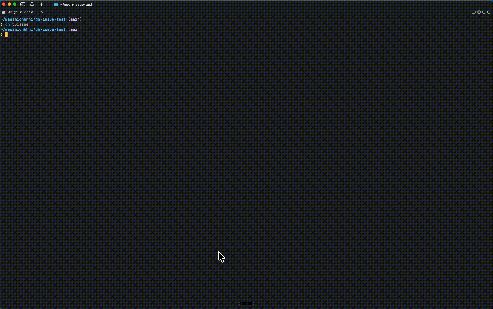

# gh-tuissue




`gh-tuissue` is a GitHub CLI extension that provides a TUI (Text User Interface) for browsing and updating repository issues from the terminal. It offers a kanban-style view backed by GitHub Issues and, when configured, GitHub Projects columns.

## Installation

Install as a GitHub CLI extension:

```bash
gh extension install masamichhhhi/gh-tuissue
```

Update later with:

```bash
gh extension upgrade gh-tuissue
```

## Features

- Browse issues in a terminal UI
- Switch columns in a kanban-style board
- Open issue details and update title, body, labels, assignees, milestone, and status
- Create new issues without leaving the terminal
- Optionally map board columns to a GitHub Project
- Bind keys to Claude Code skills and launch them on an issue as background sessions

## Preview

`gh-tuissue` is a terminal application. Once launched, it shows a multi-column issue board with detail, filter, and help views inside an alternate screen.

## Requirements

- `gh` CLI installed and authenticated
- Access to the target GitHub repository and, if used, its GitHub Project


## Usage

Inside a cloned Git repository with `origin` configured:

```bash
gh tuissue --project 1
```

Or specify a repository explicitly:

```bash
gh tuissue --repo owner/name --project 1
```

Show the current version:

```bash
gh tuissue --version
```

### Options

- `--repo`, `-R`: repository in `owner/name` format. If omitted, `origin` is used.
- `--project`, `-p`: GitHub Project number used to derive kanban columns.
- `--config`: re-select the GitHub Project binding.
- `--version`: print version and exit.

## Keyboard shortcuts

### Global

- `Ctrl+C`: quit
- `Esc`: back (on board view, quit)
- `?`: show help

### Board view

- `h` / `l` / `←` / `→`: switch column
- `j` / `k` / `↑` / `↓`: move cursor
- `H` / `L` / `Shift+←` / `Shift+→`: move issue status left or right
- `d`: hide current column
- `D`: show all hidden columns
- `Enter`: open issue detail
- `f`: open filter panel
- `s`: sort issues by created or updated date
- `r`: refresh issues
- `n`: create a new issue (assigned to the currently selected column's status)

### Detail view

- `j` / `k` / `↑` / `↓`: scroll
- `s`: toggle open or closed status
- `e`: edit body with `$EDITOR`
- `t`: edit title
- `l`: edit labels
- `a`: edit assignees
- `m`: edit milestone
- `c`: add comment with `$EDITOR`
- `Esc`: return to the board

### Filter view

- `j` / `k` / `↑` / `↓`: move cursor
- `Tab`: switch pane
- `Space`: toggle selection
- `Enter`: apply filters
- `Esc`: cancel

### Sort view

- `j` / `k` / `↑` / `↓`: move cursor
- `Enter`: apply the highlighted order
- `Esc`: cancel

Cards can be sorted by created or updated date, newest or oldest first, or kept in the default
order (project order, or most recently updated when no project is used). The order applies to
every column and is saved as `"sort"` in `.gh-tuissue.json` (`created-desc`, `created-asc`,
`updated-desc` or `updated-asc`).

## Agent actions (Claude Code)

You can bind keys to [Claude Code](https://code.claude.com) skills. Pressing a bound key on an
issue, in the board or detail view, starts a background Claude Code session that runs the skill
with the issue number. The session runs in the directory you started `gh tuissue` from, so
Claude Code picks up that directory's `.claude/` skills. The TUI keeps running; the status bar
shows the session id and the command to attach to it.

Add an `agents` list to `.gh-tuissue.json` in the repository root:

```json
{
  "project_number": 1,
  "agents": [
    { "key": "x", "skill": "ticket_resolve", "label": "Resolve ticket" },
    { "key": "X", "skill": "bugfix", "args": "{{url}}" }
  ]
}
```

- `key`: a single character. Uppercase letters mean `Shift+<letter>`. Built-in keys are reserved
  and a colliding action is skipped with a warning in the status bar.
- `skill`: the slash command to run, with or without the leading `/`.
- `label`: optional text for the help view.
- `args`: optional argument template. Supports `{{number}}`, `{{title}}` and `{{url}}`.
  Defaults to `{{number}}`.

The launched command is:

```bash
claude --bg --permission-mode auto -n "<number>-<title-slug>" "/<skill> <args>"
```

Requires the `claude` CLI on your `PATH` with background sessions support. List sessions with
`claude agents`, follow one with `claude logs <id>`, and open it with `claude attach <id>`. If
the skill stops to ask for approval, the session waits until you attach and answer.

## Contributing

Contributions are welcome. Please read [`CONTRIBUTING.md`](./CONTRIBUTING.md) before opening a pull request.

## License

This project is released under the [`MIT`](./LICENSE) license.
